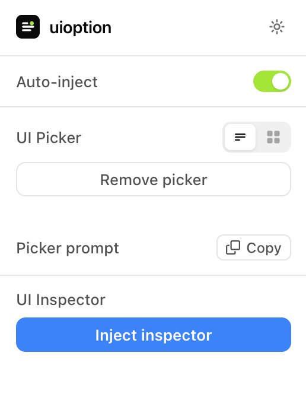

# uioption

A Chrome extension for inspecting UI components and injecting design variants on local dev pages — built for working alongside any AI coding assistant.




## What it does

- **UI Picker** — mark competing design options in your markup and flip between them live in the browser, without touching devtools or reloading.
- **UI Inspector** — hover to highlight any element, click to copy its component name, source file/line (React, Vue, Angular, Svelte), and a usable CSS selector to your clipboard.

Both tools only run on `localhost`, `127.0.0.1`, and `file://` pages.

## Install

1. Clone this repo.
2. Open `chrome://extensions`.
3. Enable **Developer mode** (top right).
4. Click **Load unpacked** and select the `src/` folder.

## Usage

### UI Picker

Ask your AI assistant to generate variants using the picker convention (the popup has a **Copy** button with this exact prompt):

```
Generate UI variants using the uioption picker: wrap each decision in
`<div data-uioption-pick="Label" class="contents">`, each option in
`<div data-uioption-option="Name" class="contents">`. One option visible,
rest hidden. 3–4 options per decision. Never add picker script tags —
the Chrome extension injects automatically.
```

Once the markup is in place, the picker widget appears automatically (if **Auto-inject** is on) and lets you cycle through options with arrow keys or a dropdown — no page reload needed to compare them.

### UI Inspector

Click **Inject inspector** in the popup, then hover any element on the page to see its framework/component info, and click to copy the details to your clipboard.

## Settings

- **Auto-inject** — automatically inject the picker on matching pages.
- **Picker style** — compact toolbar or a features grid layout.
- **Theme** — light/dark for the popup itself.

## Development

The extension itself is plain JavaScript with no build step — everything under `src/` runs as-is. [Bun](https://bun.sh) is used for tooling:

```bash
bun install          # install dev dependencies
bun run check        # lint + format (Biome)
bun run icons        # regenerate PNG icons from assets/icon.svg
bun run package      # build a versioned zip into dist/
```

## License

MIT — see [LICENSE](LICENSE).
